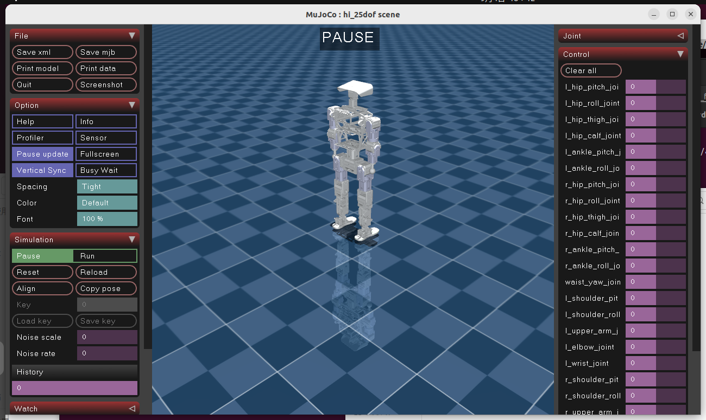

## 说明

本分支作为高擎机电所有机器人的urdf、xml最新修订版合集。

## 修改日志

**2025.09.04**：新增hi_25dof xml文件，修复pi_12dof左右腿质量问题。




**2025.09.03**： 将小hi 25自由度urdf上传 ，无xml；pi plus 24dof urdf上传，其中xml是20dof的。


**2025.08.28**：将小pi初始位置归为竖直。

训练时，default pos可以参考：

```python
    # 设置机器人默认关节角度
    default_joint_angles = [
        -0.25,  # r_hip_pitch_joint
        0.0,    # r_hip_roll_joint
        0.0,    # r_thigh_joint
        0.65,   # r_calf_joint
        -0.4,   # r_ankle_pitch_joint
        0.0,    # r_ankle_roll_joint
        -0.25,  # l_hip_pitch_joint
        -0.0,   # l_hip_roll_joint
        0.0,    # l_thigh_joint
        0.65,   # l_calf_joint
        -0.4,   # l_ankle_pitch_joint
        0.0     # l_ankle_roll_joint
    ]
```


