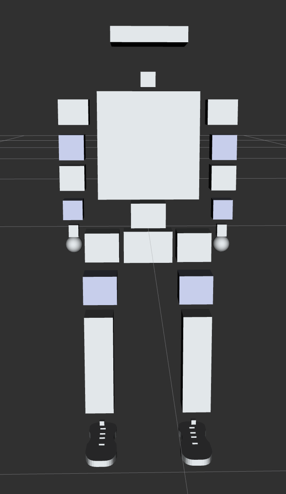
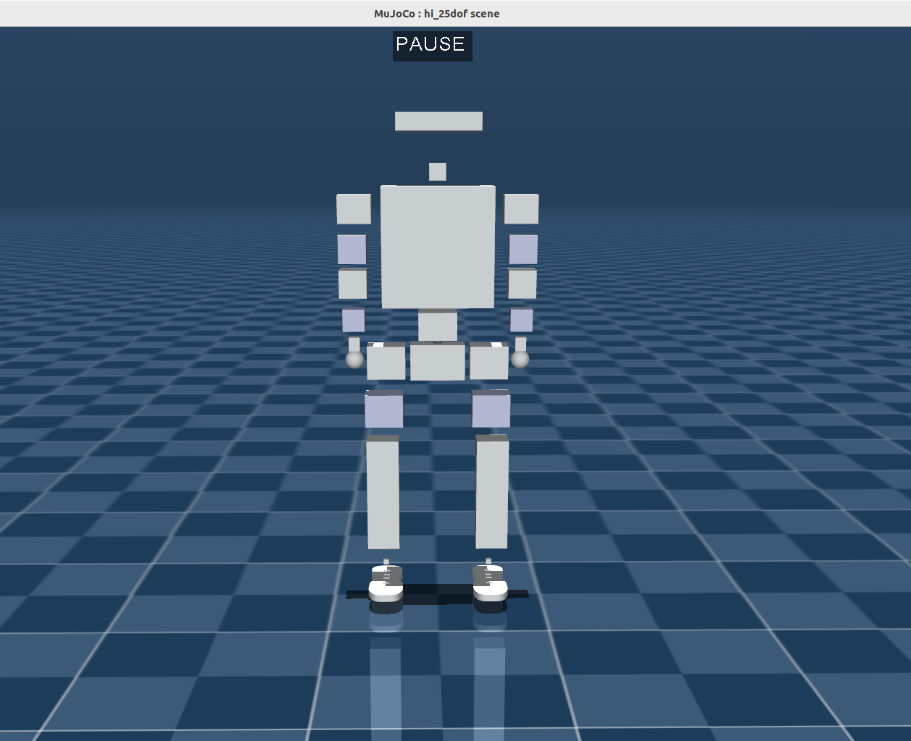

## Description

This branch serves as a collection of the latest revised versions of URDF and XML files for all HighTorque Robotics robots.

## Changelog

**2025.10.31**: Removed the hi_12dof version; modified hi XML files to add joint armature parameters and foot contact friction configuration.

**2025.09.18**: Modified the collision models of hi's URDF and XML files.





**2025.09.16**: Modified the mesh files and naming convention of joint links in hi.

**2025.09.04**: Added hi_25dof XML file; fixed the left and right leg mass issue of pi_12dof.


**2025.09.03**: Uploaded the 25-DOF (Degrees of Freedom) URDF for Mini Hi (no XML included); uploaded the 24-DOF URDF for Pi Plus, with the corresponding XML being the 20-DOF version.

**2025.08.28**: Reset Pi's initial position to vertical.

For training, refer to the following default joint angles:

```python
    # Set the robot's default joint angles
    default_joint_angles = [
        -0.25,  # r_hip_pitch_joint
        0.0,    # r_hip_roll_joint
        0.0,    # r_thigh_joint
        0.65,   # r_calf_joint
        -0.4,   # r_ankle_pitch_joint
        0.0,    # r_ankle_roll_joint
        -0.25,  # l_hip_pitch_joint
        -0.0,   # l_hip_roll_joint
        0.0,    # l_thigh_joint
        0.65,   # l_calf_joint
        -0.4,   # l_ankle_pitch_joint
        0.0     # l_ankle_roll_joint
    ]
```

要不要我帮你核对**专业术语一致性**（如DOF、URDF等）和**格式完整性**，确保适配GitHub的展示规范？


## 中文说明

本分支作为高擎机电所有机器人的urdf、xml最新修订版合集。

## 更新日志

**2025.10.31**：删除hi_12dof版本;修改hi_xml文件，增加关节armature参数，脚底接触摩擦配置。

**2025.09.18**：修改hi的urdf、xml碰撞模型。


**2025.09.16**：修改hi中meshs文件以及关节连杆的命名方式。

**2025.09.04**：新增hi_25dof xml文件，修复pi_12dof左右腿质量问题。


**2025.09.03**： 将小hi 25自由度urdf上传 ，无xml；pi plus 24dof urdf上传，其中xml是20dof的。


**2025.08.28**：将小pi初始位置归为竖直。

训练时，default pos可以参考：

```python
    # 设置机器人默认关节角度
    default_joint_angles = [
        -0.25,  # r_hip_pitch_joint
        0.0,    # r_hip_roll_joint
        0.0,    # r_thigh_joint
        0.65,   # r_calf_joint
        -0.4,   # r_ankle_pitch_joint
        0.0,    # r_ankle_roll_joint
        -0.25,  # l_hip_pitch_joint
        -0.0,   # l_hip_roll_joint
        0.0,    # l_thigh_joint
        0.65,   # l_calf_joint
        -0.4,   # l_ankle_pitch_joint
        0.0     # l_ankle_roll_joint
    ]
```


